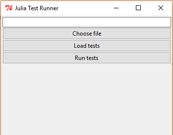

# GUITestRunner

`GUITestRunner.jl` is a Julia standalone GUI for `TestRunner.jl` package based on `Tk.jl`. It is designed to display tests defined in `FactCheck.jl`, run them and show their results. 

MIT Licensed - see LICENSE.md

### Installation

	`julia> Pkg.clone("https://github.com/meoke/GUITestRunner.jl.git")`

### Usage

1. To open the test runner window call:

	`julia> using GUITestRunner `

	`julia> GUITestRunner.start_test_runner()`

	

2. Click on *Choose file* button to choose your file with FactCheck.jl tests you work with.

	

3. Click on *Load tests* button to load your tests to the window. They are displayed according to the structure of nested facts groups and contexts.

	

4. Click on *Run tests* button to run your tests using FactCheck.jl. The results are marked with appropriate icons.

	

### Additional functions

+ You can **view details** of the specified test just by clicking on it. You can read them at the bottom of the main window or in a separate window (in order to do it click on the *Open details in new window* button).

	

+ You can also **open file with the tests on specific line** by clicking on the button next to the test name.

### Configuration

GUITestRunner can open your file with tests in a predifined text editor on the line where the test is written. To configure it edit script src/lineNumberButtonOnClick.sh or src/lineNumberButtonOnClick.bat (depending on your OS). This script is executed when a button with line number is clicked on, with following parameters:

1. line number,
2. file name.

An example script for opening the file in Kate (Linux):

	`kate -l $1 $2`

An example script for opening the file in Atom (Windows):

	`atom %2:%1`